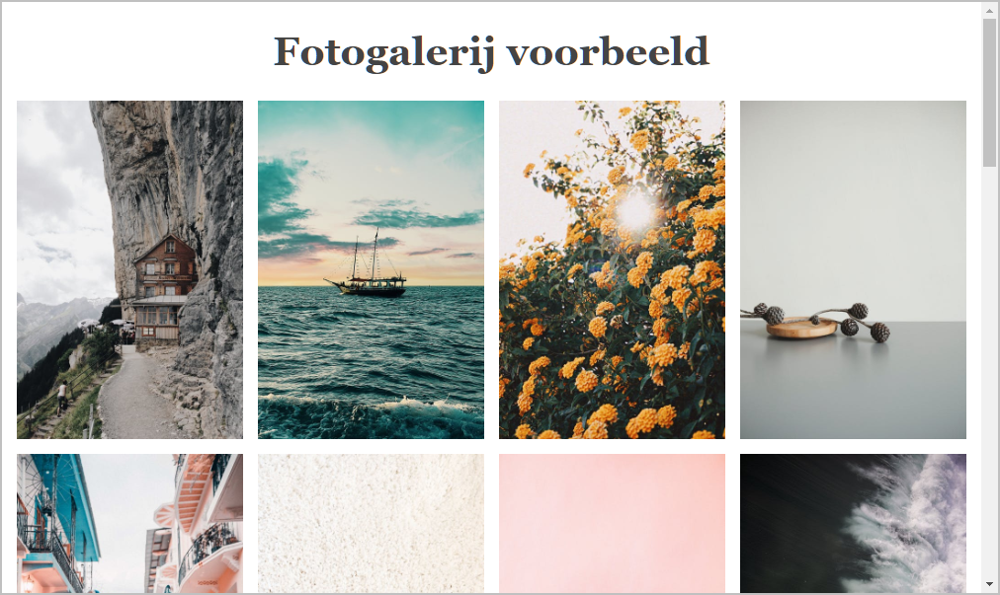

# Hoofdstuk 8: Layout Grid

Download of clone deze repository. Hiervoor klik je op de groene knop.

Pak deze zip uit in de map waar je alle leermateriaal van Webapplicaties I plaatst.

Ga nu naar Visual Studio Code en open deze map.

## Oefening 1: Learn Grid

Open de map **LearnGrid** met startbestanden in Visual Studio Code.

Om tekst zowel horizontaal als verticaal te centreren kan je gebruiken van grid. Dit wordt gedemonstreerd in de startbestanden . Het is hierbij niet nodig om de tekst in een ``-element of een `
`-element te stoppen. Dit komt omdat "each contiguous run of text that is directly contained inside a *grid container* is wrapped in an anonymous *grid item*", bron : Grid Layout specification.

Breid de webpagina uit met onderstaand diagram LEARN GRID.

Maak hierbij gebruik van Grid Layout en positioneer de vierkanten op de grid met behulp van lijnnummers.

Opmaak vierkanten:

-	de zijden van de vierkanten zijn 5 rem groot;
-	tussen de vierkanten is er een witruimte van 0,2 rem;
-	de lettergrootte is 2 rem en de letterkleur is 'darkblue';
-	de achtergrondkleur van de vierkanten is 'cyan';
-	de rand is 1 pixel breed en de kleur is 'darkblue'.
-	de letter in het vierkant is zowel horizontaal als verticaal gecentreerd.

Er zijn verschillende werkwijzen mogelijk om onderstaand diagram te bekomen. Wellicht is het, het eenvoudigst om elk vierkant (letter) van een classname te voorzien - bijv. .box1, .box2, - en vervolgens elk vierkant expliciet te positioneren op de grid. Maak voor het positioneren van de grid items bijvoorbeeld gebruik van de CSS properties `grid-column` en `grid-row`.

Te bekomen resultaat:

## Oefening 2: Grid template areas

Maak een kopie van voorgaande oefeningen-map en noem deze **GridTemplateAreas** en pas de oefening aan waarbij je gebruikmaakt van de `grid-template-areas`-property. Het is dus de bedoeling om hier geen lijnnummers te gebruiken.

## Oefening 3: Fotogalerij

Open de map **Fotogalerij** met startbestanden in Visual Studio Code. 

Pas de HTML- en CSS-code aan zodat de breedte van de pagina volledig opgevuld wordt met foto's. De foto's mogen nooit smaller worden dan 200 pixels en de overblijvende ruimte moet gelijk verdeeld worden over de verschillende foto's. De ruimte tussen de foto's is overal 15 pixels.
 
**Schermafbeelding bij een paginabreedte van 800 pixels.**

 
**Schermafbeelding bij een paginabreedte van 1024 pixels.**

## Oefening 4: Game page

Open de map **GamePage** met startbestanden in Visual Studio Code en bekijk hieronder de eerste schermafbeelding.

Voer de volgende aanpassingen uit:

1. Voeg onder het `h1`-element in het **Board**-item een `p`-element toe met daarin 120 'lorem ipsum'-woorden. Je kan hiervoor gebruikmaken van emmet: `p>lorem120`
2. Creëer een grid bestaande uit twee kolommen en drie rijen.
   - De eerste kolom is voor de 'Game Title', de 'Stats' en de 'Score'. 
Deze kolom moet de breedte krijgen van de inhoud (content). Je stelt deze dus in op 'auto'.
De tweede kolom is voor het 'Board' en de 'Controls' en krijgt alle overblijvende ruimte (leftover space).
   - Voor de eerste en de laatste rij moet de hoogte aangepast worden aan de inhoud.
De middelste rij krijgt alle overgebleven ruimte.
3. Positioneer de vijf items op de grid. Maak voor het positioneren van de grid items gebruik van `grid-column` en `grid-row`. Het **Board**-item overspant twee grid-rijen. Het **Controls**-item is gecentreerd onder het **Board**-item.
 

4. Zorg ervoor dat het **Stats**-item niet mee verhoogt als de pagina smaller wordt. Zie onderstaande schermafbeelding:

 

